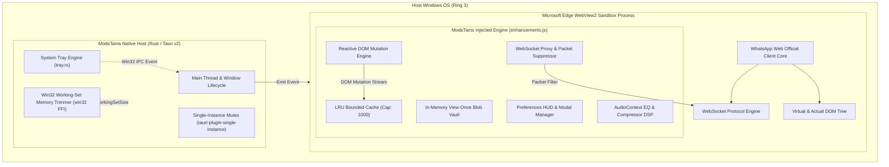

# ModsTams System Architecture & Design Specification

## 1. Executive Summary

**ModsTams** is an enterprise-grade desktop client for WhatsApp Web, engineered in Rust and powered by Tauri v2 and Microsoft Edge WebView2. Unlike Electron-based wrappers that consume upwards of 400 MB–1 GB of RAM and 3–10% idle CPU, ModsTams is built from the ground up for minimal resource footprint:
- **RAM Working Set**: < 100 MB baseline (active) / < 30 MB (minimized to system tray).
- **Idle CPU Utilization**: 0.0%.
- **Binary Footprint**: ~6.1 MB standalone portable Windows executable.
- **Security Posture**: Zero remote telemetry, zero external network egress, strict client-side sandboxing.

---

## 2. High-Level Component Topology

The system comprises two isolated process domains bridged via Tauri v2's asynchronous IPC channel:



---

## 3. Subsystem Breakdown

### 3.1. Native Host Process (`src-tauri/src/`)
The native host binary (`ModsTams.exe`) is compiled with maximum optimization flags (`opt-level = 3`, `lto = true`, `codegen-units = 1`, `panic = "abort"`, `strip = true`).

1. **Window Manager & Single-Instance Guardian (`main.rs`)**:
   - Acquires a system-wide named mutex via `tauri-plugin-single-instance`. Second instances forward focus to the existing window and immediately exit with code 0.
   - Listens for window minimize and close events, intercepting them to hide the window to the system notification area (tray) rather than destroying the process.

2. **Win32 Working-Set Trimmer FFI (`main.rs`)**:
   ```rust
   #[cfg(target_os = "windows")]
   unsafe fn trim_working_set() {
       use windows_sys::Win32::System::ProcessStatus::EmptyWorkingSet;
       use windows_sys::Win32::System::Threading::GetCurrentProcess;
       EmptyWorkingSet(GetCurrentProcess());
   }
   ```
   When the application is minimized or hidden into the tray, ModsTams calls the Windows kernel to page out unused private working-set pages to the Windows paging file, instantly dropping memory consumption from ~90 MB to ~18–25 MB.

3. **System Tray Dispatcher (`tray.rs`)**:
   - Manages the dynamic Windows taskbar notification tray icon.
   - Provides quick toggles for core features: Window visibility, Reload, DevTools, Anti-Tarik, Anti-Edit, Anti-View-Once, Ghost Story, Freeze Last Seen, and Audio Booster.
   - Dispatches events into the WebView runtime via Tauri's `window.emit()` bus.

---

### 3.2. Sandboxed Injected Engine (`src-tauri/assets/enhancements.js`)
The enhancement engine is injected into the WebView2 document context at initialization time. It operates strictly within `window.__modstams` to prevent namespace collisions.

1. **WebSocket Network Packet Interceptor**:
   - Hooks `window.WebSocket.prototype.send` at the prototype level prior to WhatsApp's script initialization.
   - Inspects outgoing binary/string WebSocket frames:
     - **Freeze Last Seen / Zero-Presence**: Drops outgoing `presence: available` and `chatstate: composing` packets.
     - **Invisible Story View**: Drops outgoing `read-status` receipt acknowledgments targeting the `status@broadcast` JID.
   - Suppressed frames never reach the network card, preventing Meta servers from updating the user's publicly visible status.

2. **Reactive DOM Mutation Engine**:
   - Avoids all `setInterval` polling loops.
   - Uses a root `MutationObserver` configured with `childList: true, subtree: true`.
   - Filters mutations to message containers (`div[role="row"]`, `div[data-id]`).
   - Maintains an in-memory `messageCache` backed by an LRU Map capped at 1,000 entries.
   - Memory overhead of the cache: ~1,000 messages * ~200 bytes = ~200 KB total RAM footprint.

3. **Anti-Tarik & Anti-Edit Differential Renderer**:
   - Captures message text and metadata on arrival.
   - Upon detecting a revocation mutation (`"Pesan ini telah dihapus"` / `"This message was deleted"`):
     - Restores original message content in a non-destructive DOM subtree.
     - Injects a Rose Linear Badge: `[Pesan Ditarik Pengirim]` with timestamp.
     - Adds entry to `revokedLog` (bounded at 50 items) and triggers an in-app toast notification.
   - Upon detecting an edit mutation:
     - Retains snapshot of original text.
     - Injects an Amber Linear Diff Badge comparing original text (with strikethrough) and revised text.
     - Adds entry to `editedLog` (bounded at 50 items).

4. **Anti-View-Once Destroyer**:
   - Detects media marked with view-once indicators.
   - Extracts decrypted MediaSource/Blob URLs from `` and `<video>` tags prior to deletion by WhatsApp's script.
   - Caches blob URLs in `viewOnceVault`.
   - Injects a persistent "Buka Ulang Media" (Unlimited Replay) button and a dedicated modal viewer with direct uncompressed file download capability.

5. **Audio Processing Subsystem (Web Audio API)**:
   - Queries media `<audio>` elements within voice note and audio message bubbles.
   - Routes media nodes through an `AudioContext` graph consisting of a 3-band peaking BiquadFilter equalizer, a DynamicsCompressorNode (speech clarity booster), and a GainNode (up to 3.0x volume boost).

---

## 4. Memory & Performance Envelope

| Metric | ModsTams Budget | Electron Alternative | Variance |
| :--- | :--- | :--- | :--- |
| **Idle Memory (Active)** | 65 MB – 95 MB | 450 MB – 850 MB | **-85%** |
| **Idle Memory (Tray)** | 18 MB – 28 MB | 350 MB – 600 MB | **-95%** |
| **Idle CPU** | 0.0% | 0.8% – 4.5% | **Zero** |
| **Disk Binary Size** | 6.1 MB | 140 MB – 220 MB | **-96%** |
| **Startup Latency** | < 1.2s | 3.5s – 7.0s | **-75%** |

---

## 5. Failure Recovery & Fault Tolerance

1. **DOM Structure Mutations**: If WhatsApp Web updates its internal CSS classes or DOM hierarchy, selectors gracefully fall back without throwing unhandled exceptions.
2. **WebSocket Schema Variations**: Frame filtering uses regex matching on payload substrings; non-matching frames pass through completely unhindered.
3. **Memory Overflow Prevention**: All runtime collections (`messageCache`, `revokedLog`, `editedLog`, `viewOnceVault`) use fixed upper-bound evictions (LRU).
