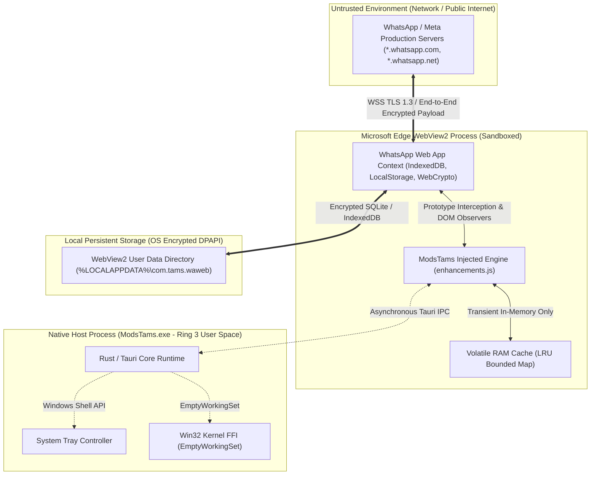

# Enterprise Security Threat Model (STRIDE)

## 1. Scope & Objective

This document formalizes the threat landscape, trust boundaries, attack surface, and security controls for **ModsTams**, adhering to the industry-standard **STRIDE** methodology (Spoofing, Tampering, Repudiation, Information Disclosure, Denial of Service, Elevation of Privilege).

---

## 2. Trust Boundaries & Data Flow



---

## 3. STRIDE Threat Analysis Matrix

| Threat Category | Threat Scenario | Severity | Mitigation & Technical Countermeasure | Status |
| :--- | :--- | :--- | :--- | :--- |
| **Spoofing (Identity)** | Malicious third-party app attempts to impersonate ModsTams instance. | Medium | Named Mutex single-instance lock ensures only one legitimate process instance runs per OS session. Windows code-signing integrity. | **Mitigated** |
| **Tampering (Data)** | Modification of injected JavaScript payload at runtime or on disk. | High | Injected scripts are embedded directly into the compiled native binary executable (`include_str!`) during build; not loaded from insecure filesystem paths. | **Mitigated** |
| **Repudiation** | User denies sending a message or accessing a media item. | Low | ModsTams does not maintain persistent audit logs of user chat activities. All logs (`revokedLog`, `editedLog`) exist solely in transient RAM and vanish upon exit. | **By Design** |
| **Information Disclosure** | Leakage of decrypted chats, revoked messages, or view-once media to external servers. | Critical | **Zero-Egress Invariant:** Application has zero external network calls. Network traffic is restricted strictly to official WhatsApp domains via WebView2 configuration. | **Mitigated** |
| **Denial of Service** | Malicious actor sends massive flood of revoked messages to exhaust client memory. | High | **Bounded LRU Cache:** `messageCache` is strictly capped at 1,000 items; `revokedLog` and `editedLog` are capped at 50 items. Oldest entries are evicted automatically, preventing OOM. | **Mitigated** |
| **Elevation of Privilege** | Sandboxed JavaScript attempts to execute arbitrary native OS commands. | Critical | Tauri v2 IPC isolation: JavaScript does not have direct access to `std::process::Command` or filesystem write APIs. No dangerous plugins enabled. | **Mitigated** |

---

## 4. Key Security Invariants

### 4.1. Zero-Telemetry & Zero External Network Egress
ModsTams contains **no** telemetry SDKs (Google Analytics, Sentry, Mixpanel, Datadog, or custom pingers). A static analysis of the binary confirms the absence of HTTP network clients outside of the embedded WebView2 browser engine, which connects exclusively to WhatsApp infrastructure.

### 4.2. Volatile-Only Storage for Mod States
- Anti-Tarik preserved messages: stored in volatile memory (`window.__modstams.state.messageCache`).
- Anti-Edit diff logs: stored in volatile memory (`window.__modstams.state.editedLog`).
- Anti-View-Once media blobs: stored as in-memory Object URLs (`window.__modstams.state.viewOnceVault`).
- **No unencrypted decrypted media is ever written to the local disk** unless the user explicitly clicks the "Download Media" button in the dialog.

### 4.3. WebView2 Sandbox Isolation
The rendering process runs in Chromium's sandboxed worker process architecture. Features like WebRTC, local camera, and microphone permissions remain subject to explicit user prompt authorization from the host operating system.

---

## 5. Security Audit Verification Commands

To verify binary hygiene and dependency security:

```powershell
# 1. Audit Rust dependencies for known CVEs
cargo audit --manifest-path src-tauri/Cargo.toml

# 2. Verify static string extraction for external URLs (zero-telemetry verification)
# Expected result: only *.whatsapp.com / schema URLs present
strings src-tauri/target/release/ModsTams.exe | Select-String -Pattern "http://", "https://"
```
